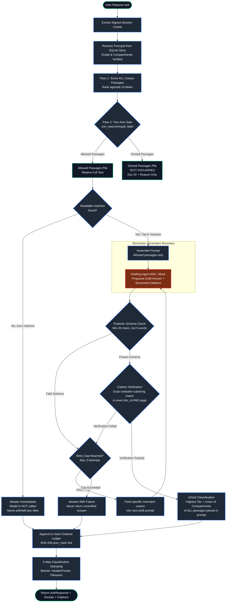

# SEVERANCE
### Sovereign Air-Gapped Document Trust Workbench for MRPL
*Smart India Hackathon 2026 — Problem Statement 26117*

---

## 1. The Thesis

SEVERANCE is a sovereign, air-gapped agentic document workbench built for Mangalore Refinery and Petrochemicals Limited (MRPL) that automates Section 10 of India's Right to Information (RTI) Act 2005 ("Severability") at the passage level. Grounded in the absolute principle that **the model proposes, the code disposes**, every access decision, two-axis security gate, citation verification, and audit entry is enforced by deterministic Python code before any prompt is assembled. By strictly decoupling hierarchical rank from orthogonal compartments and discarding denied text at the retrieval boundary, SEVERANCE mathematically guarantees that high seniority never leaks compartmentalized intelligence, hallucinations cannot survive verbatim span verification, and withheld secrets are physically absent from model context.

---

## 2. System Architecture & Request Path

The pipeline strictly separates deterministic verification code from stochastic model generation. There is exactly one LLM interaction, and it is strictly bounded by deterministic pre-retrieval gating and post-generation span verification.



---

## 3. The Two-Axis Access Control Model

Access is evaluated on two orthogonal axes. **Both axes must satisfy the criteria independently.** High hierarchical rank grants no compartment visibility.

```mermaid
flowchart LR
    classDef axis1 fill:#1e3a8a,stroke:#60a5fa,stroke-width:2px,color:#ffffff;
    classDef axis2 fill:#14532d,stroke:#4ade80,stroke-width:2px,color:#ffffff;
    classDef decision fill:#374151,stroke:#f59e0b,stroke-width:2px,color:#ffffff;
    classDef outcomePass fill:#064e3b,stroke:#10b981,stroke-width:2px,color:#ffffff;
    classDef outcomeFail fill:#7f1d1d,stroke:#f87171,stroke-width:2px,color:#ffffff;

    subgraph Axis1 [Axis 1: Hierarchical Rank - Ladder]
        direction TB
        G_I["Grade I: Director / C&MD (Rank 15)"]:::axis1
        G_H["Grade H: Executive Director (Rank 14)"]:::axis1
        G_G["Grade G: Group General Manager (Rank 13)"]:::axis1
        G_F["Grade F: General Manager (Rank 12)"]:::axis1
        G_E["Grade E: Deputy General Manager (Rank 11)"]:::axis1
        G_D["Grade D: Chief Manager (Rank 10)"]:::axis1
        G_C["Grade C: Senior Manager (Rank 9)"]:::axis1
        G_B["Grade B: Manager (Rank 8)"]:::axis1
        G_A["Grade A: Executive / AM (Rank 7)"]:::axis1
        G_JM["Non-Management JM1-JM6 (Ranks 4-6)"]:::axis1
        G_S["Non-Management S1-S4 (Ranks 1-3)"]:::axis1
    end

    subgraph Axis2 [Axis 2: Compartments - Independent Unranked Sets]
        direction TB
        C_HSE["hse (Health, Safety, Environment)"]:::axis2
        C_VIG["vigilance (Anti-Corruption & CVC)"]:::axis2
        C_LEG["legal (Contracts & Litigation)"]:::axis2
        C_COM["commercial (Procurement & Pricing)"]:::axis2
        C_TEC["technical (Refinery Process Secrets)"]:::axis2
    end

    subgraph AccessGate [Evaluation Gate in trust/labels.py]
        direction TB
        Cond1{"Rank >= TIER_FLOOR[tier]?"}:::decision
        Cond2{"doc.compartments is subset of\nuser.compartments?"}:::decision
    end

    Axis1 --> Cond1
    Axis2 --> Cond2

    Cond1 -->|No| Denied[DENIED: Insufficient Rank Floor]:::outcomeFail
    Cond2 -->|No| DeniedComp[DENIED: Missing Compartment]:::outcomeFail
    Cond1 -->|Yes| BothPass{Both Conditions Met?}:::decision
    Cond2 -->|Yes| BothPass
    BothPass -->|Yes| Allowed[ALLOWED to Read]:::outcomePass

    subgraph DemoInversion [The Headline Inversion Demo]
        GM["General Manager (Grade F, Rank 12)\nCompartments: {commercial}"]
        AM["Assistant Manager (Grade A, Rank 7)\nCompartments: {vigilance}"]
        DocVig["Vigilance Investigation Report\nTier: Confidential (Floor Rank 7)\nCompartment: vigilance"]

        GM -.->|Evaluated against DocVig| DeniedComp
        AM -.->|Evaluated against DocVig| Allowed
    end
```



---

## 4. The Permission Model: Separation of Powers

Account provisioning and compartment administration are strictly segregated. Nobody can modify their own clearance or compartments.

```mermaid
flowchart TD
    classDef admin fill:#312e81,stroke:#818cf8,stroke-width:2px,color:#ffffff;
    classDef sponsor fill:#064e3b,stroke:#34d399,stroke-width:2px,color:#ffffff;
    classDef employee fill:#374151,stroke:#9ca3af,stroke-width:2px,color:#ffffff;
    classDef blocked fill:#881337,stroke:#f43f5e,stroke-width:2px,color:#ffffff;

    AdminUser["Admin (HR / Sysadmin)\nis_admin = True"]:::admin
    CVO["Sponsor: vigilance\nChief Vigilance Officer (cvo-001)"]:::sponsor
    HeadSafety["Sponsor: hse\nHead of Safety (safety-001)"]:::sponsor
    GMUser["General Manager\nGrade F (Rank 12)\nNeither Admin nor Sponsor"]:::employee
    TargetEmployee["Target Employee\n(e.g., Process Engineer)"]:::employee

    subgraph AdminPowers [Admin Powers]
        AdminUser -->|Can Create| NewAccount[Create User Account]:::admin
        AdminUser -->|Can Set| SetGrade[Assign Grade A-I, S1-S4]:::admin
        AdminUser -->|Can Deactivate| Deactivate[Deactivate Account]:::admin
        AdminUser -.->|CANNOT GRANT| BlockedComp[Any Compartment]:::blocked
    end

    subgraph SponsorPowers [Sponsor Powers - config/compartments.json]
        CVO -->|Can Grant/Revoke ONLY| GrantVig[Grant vigilance Compartment]:::sponsor
        HeadSafety -->|Can Grant/Revoke ONLY| GrantHSE[Grant hse Compartment]:::sponsor
        CVO -.->|CANNOT GRANT| BlockedHSE[hse, legal, commercial, tech]:::blocked
    end

    subgraph SelfGrantRule [The Golden Rule: Self-Modification Blocked]
        AdminUser -.->|Blocked in Code| AdminSelf[Cannot edit own Grade or Admin status]:::blocked
        CVO -.->|Blocked in Code| CVOSelf[Cannot grant vigilance to self]:::blocked
        GMUser -.->|Zero Grant Powers| NoGrant[Cannot grant any clearance to anyone]:::blocked
    end

    SetGrade --> TargetEmployee
    GrantVig --> TargetEmployee
    GrantHSE --> TargetEmployee

    subgraph AuditTrail [Immutable Audit Trail]
        SetGrade ==> Ledger[(Hash-Chained Ledger\nActor, Subject, Action, Timestamp)]:::admin
        GrantVig ==> Ledger
        GrantHSE ==> Ledger
    end
```



---

## 5. File Tree & Purpose

```
SEVERANCE4/
├── contracts.py              # Shared Pydantic shapes & enums — the only cross-file vocabulary
├── API.md                    # Detailed documentation for all REST API endpoints
├── README.md                 # System thesis, architecture, permission model, and operational guide
├── requirements.txt          # Minimal Python dependencies (FastAPI, pydantic, pypdf, python-docx)
├── .env.example              # Template environment configuration
│
├── trust/
│   ├── __init__.py
│   ├── labels.py             # Pure security engine: RANK, TIER_FLOOR, can_read(), inherit_label()
│   └── ledger.py             # SHA-256 hash-chained SQLite audit ledger with verify() and tamper()
│
├── auth/
│   ├── __init__.py
│   ├── users.py              # User store, password hashing (scrypt), account provisioning
│   ├── sponsors.py           # Compartment ownership & delegation engine (sponsors grant own only)
│   ├── session.py            # HMAC-SHA256 signed session tokens & HttpOnly cookie handlers
│   └── deps.py               # FastAPI auth dependencies (current_principal, require_admin, etc.)
│
├── config/
│   └── compartments.json     # Declarative compartment sponsor manifest (signed off once)
│
├── harness/
│   ├── __init__.py
│   ├── retrieve.py           # Two-pass retrieval: score all candidates, gate, discard denied text
│   ├── runner.py             # Bounded verification loop: call agent, verify citations, retry/abstain
│   └── verify.py             # Pure Python string span verifier: exact match on doc_id and page
│
├── agents/
│   ├── __init__.py
│   ├── base.py               # Agent Protocol and Draft structured schema (no clearance in signature)
│   ├── mock.py               # Deterministic canned agent for air-gapped testing and deterministic retry
│   └── adk.py                # Google ADK LlmAgent adapter with exactly 4 security-gated tools
│
├── ingest/
│   ├── __init__.py
│   ├── pdf.py                # Page-level PDF extraction with loud ScannedPdfError detection
│   └── seed.py               # First-run bootstrap service for initial administrator
│
├── deliver/
│   ├── __init__.py
│   └── docx.py               # Word report builder with 3-way redundant classification stamping
│
├── api/
│   ├── __init__.py
│   ├── main.py               # FastAPI entrypoint, lifecycle hooks, and static file mounting
│   └── routes/
│       ├── __init__.py
│       ├── auth.py           # Authentication endpoints (login, logout, change-password, /me)
│       ├── admin.py          # Admin endpoints for user provisioning and grade assignments
│       ├── ask.py            # Primary query workbench endpoint (/ask)
│       ├── documents.py      # Corpus browsing endpoint with per-user readability flags
│       └── ledger.py         # Audit trail inspection and tamper-verification endpoints
│
├── ui/
│   ├── login.html            # Authentication interface with mandatory first-login password reset
│   ├── app.html              # Main workbench UI with user chip, ask panel, denials, citations
│   ├── admin.html            # Role-segregated admin & compartment sponsor management console
│   └── static/
│       ├── style.css         # Clean dark-themed CSS styling
│       └── app.js            # Vanilla JS workbench controller
│
├── corpus/
│   ├── manifest.json         # Document security labels metadata
│   ├── README.md             # Corpus management guide for refinery documentation
│   └── documents/
│       └── .gitkeep          # Repository for refinery PDF documents
│
├── scripts/
│   └── create_admin.py       # Bootstrap-code-gated CLI for emergency admin creation
│
└── tests/
    ├── __init__.py
    ├── fixtures/             # Tiny synthetic test PDFs (standard, scanned/blank, mixed)
    ├── test_labels.py        # Unit tests for two-axis access control and label inheritance
    ├── test_ledger.py        # Unit tests for hash chaining, tampering detection, and audit queries
    ├── test_auth.py          # Unit tests for session verification and client forgery immunity
    ├── test_sponsors.py      # Unit tests for sponsor separation of powers and self-grant prevention
    ├── test_retrieve.py      # Unit tests for two-pass retrieval, ranking, and text discarding
    ├── test_verify.py        # Unit tests for exact quote span matching and schema rejection
    ├── test_runner.py        # Unit tests for the retry loop and deterministic abstention
    └── test_mock.py          # Unit tests for the MockAgent implementation
```

---

## 6. Setup and Run Instructions

### Prerequisites
- Python 3.11+
- SQLite 3

### Step 1: Environment Configuration
Create a local `.env` file from the example:
```bash
cp .env.example .env
```
Edit `.env` to configure your initial administrative credentials and secrets:
```ini
SEVERANCE_ENV=development
SEVERANCE_SECRET_KEY=change-this-in-production-to-a-secure-random-token
SEVERANCE_ADMIN_ID=admin-001
SEVERANCE_ADMIN_PASSWORD=InitialAdminPassword123!
SEVERANCE_BOOTSTRAP_CODE=mrpl-sih-2026-bootstrap-key
SEVERANCE_DB_PATH=severance.db
AGENT_BACKEND=mock # Use 'mock' for offline testing, 'adk' for Google ADK
```

### Step 2: Virtual Environment & Dependencies
```bash
python3 -m venv venv
source venv/bin/activate
pip install -r requirements.txt
```

### Step 3: Run the Test Suite
Execute the entire test suite to verify the security core in isolation:
```bash
pytest -v tests/
```

### Step 4: Start the Server
Launch the FastAPI server:
```bash
uvicorn api.main:app --host 127.0.0.1 --port 8000 --reload
```
Navigate to `http://127.0.0.1:8000/` in your browser. The application will automatically seed the initial admin user on first startup.

### Step 5: Bootstrap Ordering
1. Log in as `admin-001`. You will be prompted to change your temporary password.
2. In the Admin console, create the sponsor accounts declared in `config/compartments.json`:
   - `cvo-001` (Chief Vigilance Officer)
   - `safety-001` (Head of Safety)
   - `legal-001` (Company Secretary)
   - `comm-001` (GM Commercial)
   - `tech-001` (GM Technical)
3. Log out and log in as any sponsor (e.g., `cvo-001`) to grant compartment clearances to personnel.

---

## 7. What is Not Built Yet (Honest Engineering Boundaries)

1. **Semantic Vector Embeddings**: Retrieval currently uses a deterministic, air-gapped lexical BM25/keyword scoring engine. Dense vector embeddings (e.g. via local ONNX or sentence-transformers) can be dropped in without changing the two-axis gate, as the gate operates on candidates after scoring regardless of score provenance.
2. **Optical Character Recognition (OCR)**: Scanned PDFs lacking an embedded text layer are deliberately flagged and rejected with a loud `ScannedPdfError` rather than routed to an OCR pipeline. This prevents silent OCR degradation or hallucination on critical engineering diagrams.
3. **Multi-Node Byzantine Distributed Ledger**: The audit ledger is an immutable, hash-chained SQLite table local to the node. While mathematically tamper-evident (any record modification breaks the cryptographic SHA-256 chain), it is not a multi-master distributed consensus network.
4. **Hardware Security Module (HSM) Signing**: Session tokens are signed using standard library HMAC-SHA256 with an ephemeral/configured secret key, rather than hardware-backed PKCS#11 cryptographic smartcards.
5. **Real MRPL Internal Documents**: By design, genuine MRPL operational records are confidential. The repository contains a structured manifest and placeholder scaffolding. Authorized MRPL administrators add real refinery PDFs directly to `corpus/documents/`.
